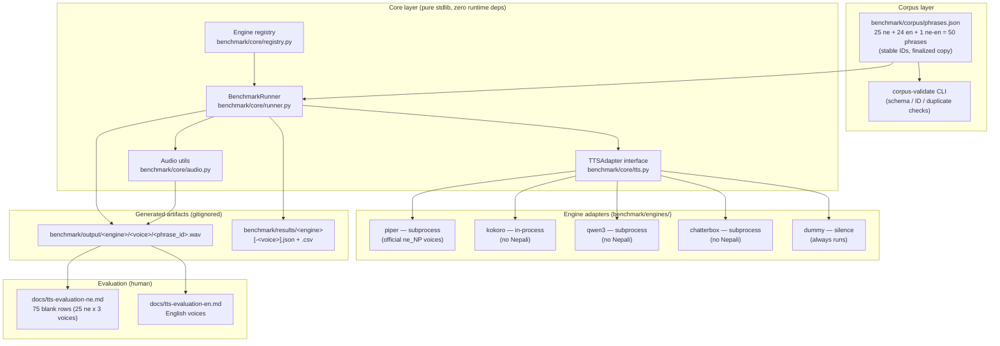

# Custom Navigation Voice Generator — TTS Benchmark

> **Status: TTS evaluation prototype.** This repository is *not* the final navigation
> application. It is a standalone benchmark for comparing open-source/local TTS
> engines on Nepali (+ English/mixed) navigation instructions, to decide which
> engine the eventual app should use.

## 1. Project purpose

The end goal is a tool that lets users create **personalized navigation voice
instructions for Waze** — show navigation situations, let users customize the
instruction text, synthesize speech, preview it, and eventually record and export
a voice pack.

Before building any of that, we need to know one thing: **which open-source/local
TTS engine gives the best speech quality for Nepali navigation instructions?**
This repository answers that question with a reproducible, engine-agnostic
benchmark.

## 2. Current scope

- A standardized navigation phrase corpus (~48 phrases: directions, distances,
  traffic, enforcement, arrival, and language tests).
- A common TTS engine abstraction (`TTSAdapter`) with adapters for the initial
  candidates: **Piper, Kokoro, Qwen3-TTS, Chatterbox**, plus a `dummy` adapter
  for pipeline testing.
- A benchmark runner that synthesizes the whole corpus per engine, isolates
  failures, times generations, and writes structured metadata (JSON + CSV).
- Tests for the core logic, documentation, and reproducible setup instructions.

**Out of scope (by design):** the Flutter app, Waze integration, recording
workflow (including the 3-second preparation delay), voice pack export, any
backend/cloud/auth/database. None of those exist here yet.

## 3. Why Flutter is not being built yet

The entire product experience depends on the TTS engine's quality for **Nepali
speech**. If the engine sounds bad, the app's core value disappears regardless of
how good the UI is. Building the app now would also freeze the TTS choice before
we have data to justify it. The benchmark is the cheapest possible way to de-risk
that decision.

## 4. Benchmark architecture

Full system flow:



Key properties:

- **Engine-agnostic core.** The runner talks to `TTSAdapter.synthesize()` only.
  Adding an engine = adding one adapter package + registering it. The core never
  changes.
- **Isolation.** One engine failing (missing binary, crashed process, unsupported
  phrase) does not stop the others. Unavailable engines are recorded with a
  reason instead of erroring the run.
- **No hard-coded phrases** in any engine code — everything reads the corpus.
- **Standardized audio target:** 16 kHz mono PCM WAV (adapters may need ffmpeg to
  convert engine-native output). No artificial silence is added by the benchmark.

## 5. Supported candidate engines

| Engine       | Adapter   | Runs on this machine? | Nepali support        |
| ------------ | --------- | --------------------- | --------------------- |
| Piper        | `piper`   | needs `piper` CLI     | ✅ **official voices** (`ne_NP` chitwan, google) — quality unverified |
| Kokoro       | `kokoro`  | needs `kokoro-onnx`   | ❌ **not supported** — English voices only |
| Qwen3-TTS    | `qwen3`   | needs own env + CLI   | ❌ not in the 10 supported languages — unverified |
| Chatterbox   | `chatterbox` | needs own env + CLI | ❌ not in the 23 supported languages (Hindi finetune exists) |
| Dummy        | `dummy`   | ✅ always             | — (silence) |

**No engine is claimed to *sound good* in Nepali — that is what the benchmark
measures.** Engines without Devanagari support receive the Latin `tts_text` rendering
of Nepali phrases (a compromise to evaluate, not a capability claim). Piper is the only
candidate with official Nepali voices. License status is tracked separately in
`docs/decisions/engine-licensing.md` (several items marked UNKNOWN — REQUIRES
VERIFICATION).

## 6. Corpus structure

`benchmark/corpus/phrases.json` — an array of entries with **stable IDs**:

```json
{
  "id": "speed_camera_001",
  "category": "enforcement",
  "language": "ne-en",
  "text": "स्पिड क्यामेरा छ है। अब एक्सन हिरो नबन्!",
  "tts_text": "Speed camera chha hai. Ab action hero nabana!",
  "expected_pronunciation": "Humorous Nepali: 'there is a speed camera, don't be an action hero now!'",
  "tags": ["humor", "mixed", "english_word"]
}
```

Categories: `directions`, `distances`, `traffic`, `enforcement`, `arrival`,
`language_tests`. Languages: `ne`, `en`, `ne-en` (mixed). See
`benchmark/corpus/README.md` for the full schema and rules.

## 7. Installation / setup

Requires **Python 3.10+** (Python 3.12 recommended). macOS users: `brew install
python@3.12`. Qwen3-TTS and Chatterbox additionally need their own Python
environments (see `docs/tts-evaluation.md`) — they are not installed here.

```bash
# 1. Create the virtualenv and install the benchmark core
python3.12 -m venv .venv
.venv/bin/pip install -e ".[dev]"

# 2. Install an engine you want to actually synthesize with, e.g. Piper
.venv/bin/pip install piper-tts

# 3. Check what's runnable
.venv/bin/benchmark-run --list
```

The benchmark core itself has **zero runtime dependencies** (pure stdlib) —
pytest/ruff are dev-only. Audio conversion for non-standard engine output uses
`ffmpeg` if present; without it, engines keep their native rate and record that
in the metadata.

## 8. Run an individual engine

```bash
.venv/bin/benchmark-run --engines piper
```

## 9. Run the full benchmark

```bash
.venv/bin/benchmark-run            # all registered engines
.venv/bin/benchmark-run --force    # regenerate even if WAVs already exist
.venv/bin/benchmark-run --engines piper kokoro --sample-rate 16000
```

Engines that can't run are skipped and recorded as `unavailable` in the results
directory. The run **never fails** because one engine is missing.

## 10. Reproducing the benchmark on another machine

Generated WAVs, the `piper-tts` package, and the voice models are all **gitignored**,
so a fresh clone has none of them. Everything is regenerable in three steps.

### 10.1 Clone and set up the venv

```bash
git clone https://github.com/roshandroids/custom-navigation-voice-generator.git
cd custom-navigation-voice-generator
python3.12 -m venv .venv
.venv/bin/pip install -e ".[dev]" piper-tts
```

> **Note:** `piper-tts` is not declared in `pyproject.toml` — it is installed manually
> (v1.6.1 on the machine that generated the current benchmark). Add it to the `dev`
> optional-dependencies to make setup reproducible.

### 10.2 Get the voice models (~167 MB total, not in git)

The Piper adapter looks up models by exact filename in
`benchmark/engines/piper/models/` (each voice needs `<voice>.onnx` + `<voice>.onnx.json`).

**Option A — copy from the machine that already has them:**

```bash
rsync -av benchmark/engines/piper/models/ \
  user@newhost:/path/to/project/benchmark/engines/piper/models/
```

**Option B — download from Hugging Face** (`rhasspy/piper-voices`): fetch the three
official Nepali voices and place both files per voice in
`benchmark/engines/piper/models/`:

- `ne_NP-chitwan-medium.onnx` + `.onnx.json`
- `ne_NP-google-medium.onnx` + `.onnx.json`
- `ne_NP-google-x_low.onnx` + `.onnx.json`

### 10.3 Generate

```bash
# Full 50-phrase corpus x 3 Nepali voices
.venv/bin/benchmark-run --engines piper --piper-voices all --force

# Verify setup
.venv/bin/corpus-validate && .venv/bin/benchmark-run --list
```

WAVs land in `benchmark/output/piper/<voice>/`, metadata in
`benchmark/results/`. The corpus text and benchmark engine are committed, and Piper
output is deterministic for a given model + text — so the same piper version produces
the same WAVs on any machine. RTF (generation speed) varies by CPU, but audio output
matches.

**Caveats:**

- The previous benchmark ran on Apple M1 CPU; any platform works with the same ONNX
  models, but generation time will differ.
- The `ne_NP-*` voice models have per-voice MODEL_CARD licensing — see
  `docs/decisions/engine-licensing.md` before distributing models beyond your own
  machines.
- Never commit models or WAVs — both are gitignored by design.

## 11. Where generated WAV files are stored

```
benchmark/output/
├── piper/speed_camera_001.wav
├── kokoro/turn_left_001.wav
└── ...
```

One directory per engine, one WAV per phrase (`<phrase_id>.wav`). Audio is
**gitignored** — never commit generated audio.

## 12. Where benchmark metadata is stored

```
benchmark/results/
├── <engine>.json   # full metadata per phrase (see below)
└── <engine>.csv    # flattened table for analysis
```

Each result records: engine, model, voice, phrase ID, text, generation timestamp,
generation duration, output duration, sample rate, channels, output file,
success/failure, error message. See `benchmark/results/README.md` for the JSON
shape. Human evaluation scores (naturalness, pronunciation, navigation clarity)
will be added to this format in a later milestone.

**Current evaluation state:** the finalized 25-phrase Nepali corpus has been
synthesized with the three Piper voices (75 WAVs, generated 2026-08-15). Human
scores are **pending** — see `docs/tts-evaluation-ne.md` (blank 1–5 table, priority
listening flags) and `docs/tts-evaluation-en.md` for the English voices. No voice is
selected automatically; selection requires human listening.

## 13. How to add a new TTS engine

1. Create `benchmark/engines/<name>/` with an `adapter.py` implementing
   `benchmark.core.tts.TTSAdapter` and a matching `__init__.py`.
2. Decorate the class with `@register` (from `benchmark.core.registry`) — it is
   picked up automatically when `benchmark.engines` is imported.
3. Implement `synthesize(text, output_path) -> AudioInfo` and override
   `check_available()` if the engine has external requirements.
4. Keep heavy/conflicting dependencies inside the adapter (import lazily, or
   shell out to the engine's own environment).
5. Run `benchmark-run --list` and `pytest`.

See `benchmark/engines/dummy/adapter.py` — the minimal reference adapter.

## 14. How to add a new phrase

```bash
.venv/bin/corpus-add-phrase \
    --text "अगाडि ढिलो गाडी छ।" \
    --category traffic --language ne --tags slow_traffic
```

or edit `benchmark/corpus/phrases.json` directly, then:

```bash
.venv/bin/corpus-validate
```

IDs are stable by contract: keep existing IDs, add new ones for new phrases
(renaming orphans previously generated audio and results).

## 15. Waze voice-pack generation

`benchmark/corpus/waze_voicepack.json` is a separate, dedicated corpus: the exact
43-phrase "Record your own voice" script from Waze's Nepali voice-recording screen
(Start of drive, Distances, Instructions, Reports, Other), each with natural
spoken-Nepali text reviewed in `docs/nepali-waze-voicepack-review.md`. It uses two
extra categories (`start_of_drive`, `other`) not present in the main corpus.

Unlike `benchmark-run`, which sends every phrase in a corpus through whichever voice
is selected regardless of the phrase's own language, `waze-voicepack-run` always
routes each phrase to a voice that can actually speak its language — English phrases
to the `en_US-*` voices, Nepali phrases to the `ne_NP-*` voices:

```bash
.venv/bin/waze-voicepack-run            # all 3 Nepali + all 3 English voices
.venv/bin/waze-voicepack-run --force    # regenerate even if WAVs already exist
.venv/bin/waze-voicepack-run --ne-voices ne_NP-google-medium --en-voices en_US-ljspeech-medium
```

Output: `benchmark/output/waze/piper/<voice>/<phrase_id>.wav`, metadata in
`benchmark/results/waze/`. Same gitignore rules as the main benchmark — never commit
generated audio.

## 16. Known limitations

- **Nepali *quality* is unproven for every engine, including Piper.** Piper has
  official Nepali voices; the others don't (Kokoro/Chatterbox) or don't list Nepali
  among supported languages (Qwen3-TTS). The benchmark's job is to measure quality.
  Nothing here claims otherwise.
- Qwen3-TTS and Chatterbox adapters shell out to CLIs whose exact flags are
  **unverified** — they need a real install to confirm.
- `ffmpeg` is optional; without it, audio normalization (16 kHz mono) can't be
  enforced for engines that output other formats.
- Timing measures wall-clock generation (process + I/O), not pure model time.
- The benchmark currently runs sequentially; parallel execution is a future
  optimization, not a correctness concern.

---

## Layout

```
├── README.md
├── LICENSE                 (MIT — applies to *this project's code*, see docs/decisions/engine-licensing.md for engines)
├── .gitignore
├── .editorconfig
├── pyproject.toml
├── benchmark/
│   ├── corpus/             (phrases.json + schema)
│   ├── core/               (runner, registry, TTSAdapter, corpus, audio)
│   ├── engines/            (piper/, kokoro/, qwen3/, chatterbox/, dummy/)
│   ├── output/             (generated WAVs — gitignored)
│   ├── results/            (JSON/CSV metadata — gitignored)
│   └── scripts/            (run_benchmark, validate_corpus)
├── docs/
│   ├── tts-evaluation.md          (engine setup + evaluation guide)
│   ├── tts-evaluation-ne.md       (Nepali MVP — 75 blank rows, human scores)
│   ├── tts-evaluation-en.md       (English voice evaluation)
│   ├── nepali-human-review-v2.md  (final Nepali linguistic review)
│   ├── decisions/
│   │   ├── engine-licensing.md
│   │   └── nepali-content-final.md
│   └── architecture.md
├── tests/
└── tools/add_phrase.py
```

## Quick start

```bash
python3.12 -m venv .venv
.venv/bin/pip install -e ".[dev]"
.venv/bin/corpus-validate
.venv/bin/benchmark-run --list
.venv/bin/benchmark-run --engines dummy   # end-to-end pipeline without real TTS
pytest
```
