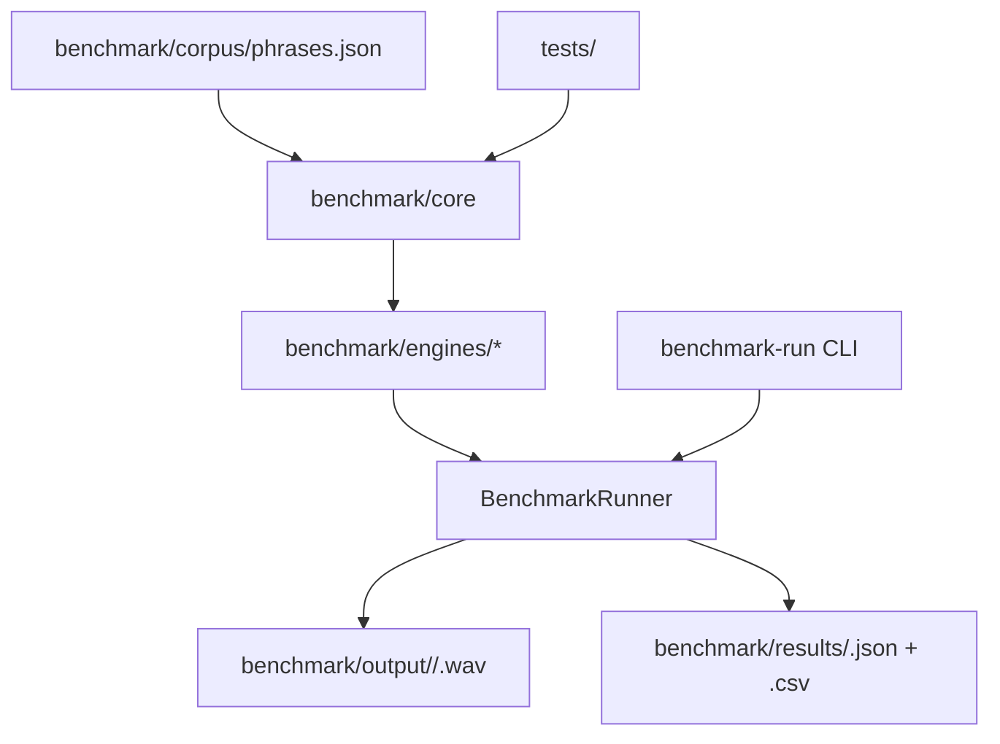

# System architecture

## Overview

The current system is a **standalone TTS benchmark prototype** — not the final application. It is a Python package that runs multiple TTS engines against a shared phrase corpus and records structured evaluation data.

Layers:
- **Corpus** (`benchmark/corpus/`) — the standardized 50-phrase navigation corpus (`phrases.json` + JSON schema), the single source of truth for phrases.
- **Core** (`benchmark/core/`) — engine abstraction (`TTSAdapter`), engine registry, corpus loader/validator, benchmark runner, audio utilities. Zero runtime dependencies (pure stdlib).
- **Engines** (`benchmark/engines/`) — one adapter package per TTS engine (piper, kokoro, qwen3, chatterbox, dummy). Adapters implement `TTSAdapter` and register via `@register`.
- **Scripts/CLI** (`benchmark/scripts/`) — `benchmark-run`, `corpus-validate`.
- **Output/Results** — generated WAVs (`benchmark/output/<engine>/`) and metadata (`benchmark/results/<engine>.json|.csv`), both gitignored.

## Module graph

## Constraints

- **Engine-agnostic core**: the runner depends only on the `TTSAdapter` interface + registry; adding an engine never touches core logic.
- **Isolation**: one engine failing (missing binary, crash) must not stop others; unavailable engines are recorded with a reason.
- **No hard-coded phrases** in engine code — everything reads the corpus.
- **Standardized audio**: 16 kHz mono PCM WAV target; no artificial silence added by the benchmark (the 3-second recording delay belongs to the future recording workflow).
- **Generated artifacts stay out of git** (WAVs, results, models).
- Keep it simple: no unnecessary frameworks, services, factories, or DI.
