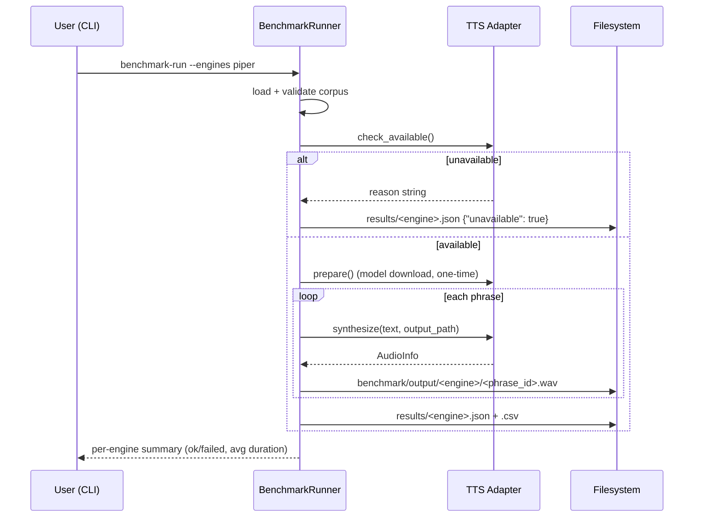

# Key flows

## End-to-end path of a typical request

## Other important flows

- **Corpus validation** (`corpus-validate`): load → validate schema/IDs/duplicates → report stats.
- **Add a phrase** (`corpus-add-phrase`): generate next stable ID, validate before writing, append to `phrases.json`.
- **Human listening evaluation (future)**: generated WAV → human scores (naturalness, pronunciation, navigation clarity) → appended to result format.
- **Future product workflow** (after engine selection): navigation situation → standard instruction → custom instruction → TTS → preview → recording mode → preparation delay → generated voice plays → user manually records into Waze.
