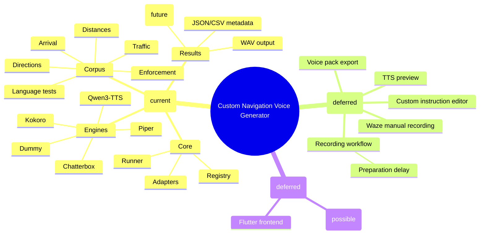

# Feature mindmap

## Feature mindmap

## Scope guardrail

Only the **TTS Benchmark** branch exists today. Flutter app, backend, and Waze integration are intentionally deferred (see background and [[tts-benchmark-milestone]]).
