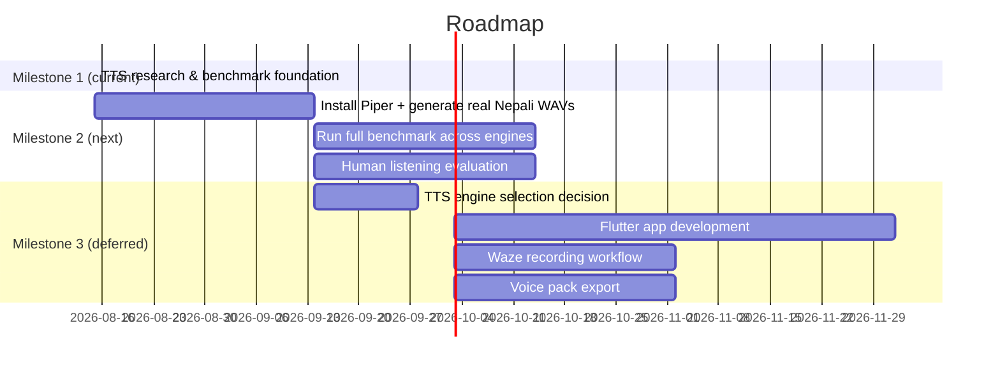

# Roadmap

## Milestones

## Status

- **Milestone 1 (current):** TTS research and benchmarking — foundation is complete (corpus, engine abstraction, runner, tests, docs). Real engine audio is the next step.
- Flutter, backend, and Waze integration are **intentionally deferred** until the TTS engine evaluation provides sufficient evidence.
