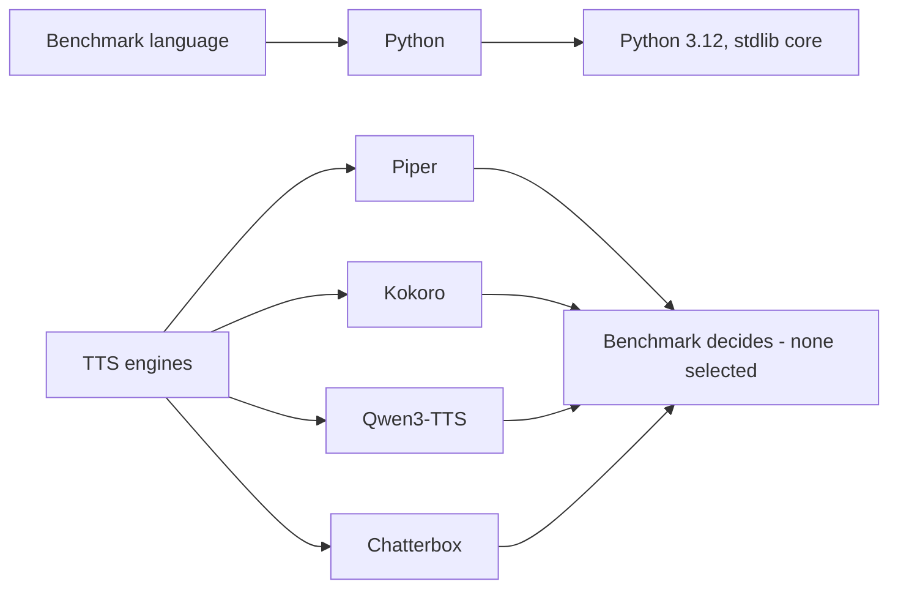

# Tech stack

## Technology choices

| domain | candidates | decision | rationale |
|---|---|---|---|
| Benchmark language | — | **Python 3.10+ (3.12 used)** | The open-source TTS ecosystem (Piper, Kokoro, Qwen3-TTS, Chatterbox) is primarily Python-oriented. |
| Benchmark core | — | **Pure stdlib, zero runtime deps** | Keep the runner simple and reproducible; pytest/ruff are dev-only. |
| Package/deps | — | **pip + pyproject.toml (editable install)** | Standard, minimal; `.venv` per project. |
| Testing | — | **pytest** | Standard for Python; tests cover corpus, registry, runner. |
| Linting/format | — | **ruff** | Single fast tool for lint + format. |
| TTS engines | Piper, Kokoro, Qwen3-TTS, Chatterbox | **All four scaffolded; none selected yet** | The benchmark's job is to decide; an engine may be marked unavailable without breaking runs. |
| Audio | — | **WAV, 16 kHz mono PCM target** | Standardized for fair comparison; ffmpeg optional for resampling engine-native output. |
| Frontend (future) | — | **Flutter (intended)** | Deferred until TTS evaluation. Not built now. |
| Backend (future) | — | **Python/FastAPI TTS service (possible)** | Not built now; no production backend yet. |

## Decision mindmap

## Open items

- **Which TTS engine wins for Nepali** — the benchmark's core question; no decision yet.
- **Piper voice selection** (`ne_NP-chitwan` vs `ne_NP-google`) — to be tested.
- Engine-specific CLI flags for Qwen3-TTS and Chatterbox — unverified at scaffold time.
- Flutter/FastAPI remain future, provisional choices.
